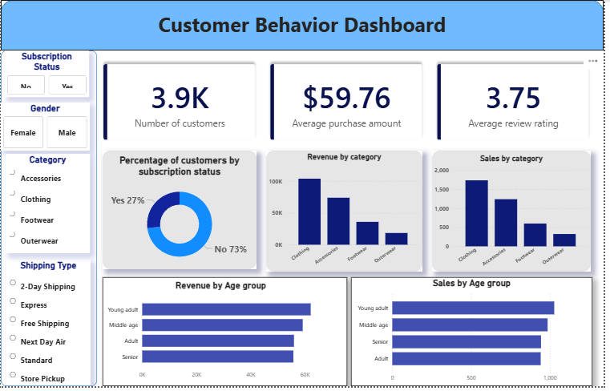

# customer_purchase_behaviour
## Project overview

This project replicates a real-world, end-to-end corporate data analytics workflow, turning raw data into actionable business insights. It demonstrates the ability to clean, analyse, and visualize data to support strategic data-driven decision-making and recommendations.
This project covers the full analytics lifecycle:

*•	Data Preparation, Modelling & EDA (Python):* performed data cleaning, transformation, and exploring the dataset to ensure quality and reliability.

*•	Data Analysis (SQL):*  Simulated business scenarios and queried data to uncover insights on customer segments, loyalty, and purchasing patterns.

*•	Visualization & Insights (Power BI):* Designed an interactive dashboard to communicate key metrics and trends.

*•	Reporting & Presentation:*  Delivered insights and actionable business recommendations based on data findings.

## Objective

To analyze customer purchase data to identify key trends, understand the factors inflencing customer decisions and to uncover pattern related to discounts, reviews, shipping preferences, payment methods that drive engagement and repeated purchases.
The insight is aimed to support improved customer enagagement and optimized product and market strategies.

## Dataset Information
•	The dataset contains 3,900 rows and 18 columns.

*Key Features:*

•	Customer Demographics: Age, gender, location, and subscription status

•	Purchase Details: Items purchased, category, purchase amount, size, and color

•	Shopping Behaviour: Discount usage, promo codes, past purchases, purchase frequency, review ratings, and shipping type

*Missing Data:* 

37 missing values in the Review Rating column

*Tools*:

Python(Pandas, Matplotlib), SQL, Power BI

## Methodology
**1.Exploratory data analysis using Python-Pandas:**

Started the project with data cleaning and preparation in Python to make the dataset reliable for analysis.

-Data Loading: Loaded the dataset using pandas.

-Initial Exploration: Reviewed dataset structure with df.info()  to check the structure and generated summary statistics using `df.describe()`.  

-Handling Missing values: Checked for null values using df.isna().sum() and imputed 37 missing entries in the Review rating column using the median rating of each product category.

-Column Standardisation: Renamed columns to snake case for consistency and improve readability and documentation.

-Feature Engineering:
	Created an ‘age_group’ column by binning customer ages.
	Derived a ‘purchase_frequency_days’ column from purchase data.
-Data Validation: Compared ‘discount_applied’ and ‘promo_code_used’ to check duplicates; dropped ‘promo_code_used’- redundant column.
-Database Integration: Connected Python script to PostgreSQL and loaded the cleaned dataset into the database for SQL analysis.

**2.Data analysis using SQL:**

Conducted structured analysis in PostgreSQL to answer key business questions.

### 1.Revenue by Gender

Compared total revenue generated by male vs. female customers.

``` sql
SELECT 
	gender, 
	SUM(purchase_amount) AS total_revenue
FROM customer_details
GROUP BY gender
;
```
### 2.High-Spending Discount Users

Identified customers who used discounts yet spent above the average purchase amount.

```sql
SELECT
	customer_id, purchase_amount
FROM customer_details
WHERE 
	discount_applied = 'Yes' 
	AND purchase_amount >= (SELECT AVG(purchase_amount)FROM customer_details)
;
```

### 3.Top 5 Products by Rating

Found best reviewed products with the highest average review ratings.

```sql
SELECT 
	item_purchased, 
	category, 
	ROUND(AVG(review_rating::numeric),2) AS avg_product_rating
FROM customer_details
GROUP BY item_purchased, category
ORDER BY AVG(review_rating) DESC 
LIMIT 5
;
```

### 4.	Shipping Type Comparison

Compared average purchase amounts between standard and express shipping.

```sql
SELECT 
	shipping_type, 
	round(AVG(purchase_amount),2)
FROM customer_details
WHERE shipping_type IN('Express', 'Standard')
GROUP BY shipping_type
;
```

### 5.	Subscribers vs. Non-Subscribers- Analysed differences in average spend and total revenue across subscription status.

```sql
SELECT
	subscription_status,
	COUNT(customer_id) AS total_customers,
	ROUND(AVG(purchase_amount),2) AS avg_spend, 
	ROUND(SUM(purchase_amount),2) AS total_revenue
FROM customer_details
GROUP BY subscription_status
ORDER BY avg_spend, total_revenue
DESC
;
```

### 6.	Discount-dependent Products- Identified 5 products that rely heavily on discounts to sell.

```sql
SELECT 
	item_purchased,
	round(100* SUM(
			CASE 
			WHEN discount_applied ='Yes' THEN 1 
			ELSE 0
			 END)/COUNT(*),2
			) AS discount_rate
FROM customer_details
GROUP BY item_purchased
ORDER BY discount_rate DESC
LIMIT 5
;
```

### 7.	Customer segmentation- Split customers into new, returning and loyal segments based on purchase history.

```sql
WITH customer_type AS (
	SELECT
		customer_id, 
		previous_purchases,
		CASE 
			WHEN previous_purchases BETWEEN 2 AND 10 THEN 'Returning_customers'
			WHEN previous_purchases < 10 THEN 'Loyal_customers'
		ELSE 'New_customers'
		END AS customer_segmentation
	FROM customer_details
	)
SELECT
	customer_segmentation, 
	COUNT(*) AS "number_of_customers"
FROM customer_type
GROUP BY customer_segmentation
;
```

### 8.	Top 3 products per category- Listed the most purchased products within each category.

```sql
WITH item_count AS(
		SELECT 
			category,
			item_purchased,
			COUNT(customer_id) AS total_orders,
			ROW_NUMBER() OVER(PARTITION BY category ORDER BY COUNT(customer_id)DESC) AS item_rank
FROM customer_details
GROUP BY category, item_purchased
)

SELECT
	item_rank, 
	category, 
	item_purchased,
	total_orders
FROM item_count 
WHERE item_rank <=3
;
```

### 9.	Repeat buyers and Subscriptions- Evaluated whether customers with > 5 purchases are more likely to subscribe.

```sql
SELECT
	subscription_status,
	COUNT(customer_id) AS repeat_customers
FROM customer_details
WHERE previous_purchases > 5 
GROUP BY subscription_status
ORDER BY repeat_customers DESC
;
```

### 10.	Revenue by Age group- Calculated total revenue contribution of each age group.

```sql
SELECT
	age_group, 
	SUM(purchase_amount) AS total_revenue
FROM customer_details
GROUP BY age_group
ORDER BY total_revenue DESC
;
```

**3.Visualization on Power BI- Dashboard:**

Built an interactive dashboard in Power BI to visually present key-insights and trends from the data.



## Business – Impact and Future improvements.

*-Boost subscriptions*- Promote exclusive offers and benefits for subscribers.

*-Customer loyalty programs*- Incentivize repeat buyers to convert them into the ‘Loyal’ customers.

*-Review discount strategy*- Optimize discount usage to increase sales while maintaining profit margin.

*-Product positioning*- Feature top-rated and best-selling products in marketing campaigns.

*-Targeted marketing*- Focus efforts on high-revenue age groups and express shipping users.

